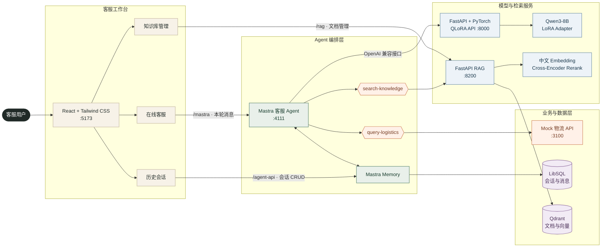

# 中文客服 QLoRA 全栈项目

这是一个可在本地完整运行的中文电商客服示例，覆盖数据集、QLoRA 训练、PyTorch 推理接口、Mastra Agent、持久化会话记忆、RAG 知识库、业务 Tool 和 React 客服工作台。

## 系统架构



对话请求只提交本轮用户消息以及稳定的 `resource/thread` 标识。Mastra 从 LibSQL 恢复最近 20 条消息后调用模型；物流问题调用 Mock Tool，政策和商品知识问题调用 RAG Tool。前端的知识库页面则直接调用 RAG API 完成文档管理。

## 项目目录

| 目录 | 技术栈 | 用途 |
| --- | --- | --- |
| [`customer-frontend`](customer-frontend/README.md) | React、Vite、Tailwind CSS | 客服对话、历史会话、知识管理和物流结果展示 |
| [`customer-agents`](customer-agents/README.md) | Mastra、TypeScript、LibSQL | 客服 Agent、会话记忆、物流与知识检索 Tool |
| [`customer-frontend-logistics-api`](customer-frontend-logistics-api/README.md) | Node.js、Express | 本地 Mock 物流数据服务 |
| [`customer-http-qlora`](customer-http-qlora/README.md) | FastAPI、PyTorch、PEFT | QLoRA 推理及 OpenAI 兼容接口 |
| [`customer-rag-api`](customer-rag-api/README.md) | FastAPI、FastEmbed、Qdrant | 文档摄取、中文向量检索和 Rerank |
| [`customer-service-qlora`](customer-service-qlora/README.md) | LLaMA-Factory、MLX-LM | Windows/macOS 模型训练资产 |

## 环境要求

- Windows 训练和全栈联调：Node.js 22、pnpm 10、PowerShell 7、Python 3.11。
- QLoRA 推理：支持 CUDA 的 NVIDIA GPU；当前环境已验证 RTX 5070、PyTorch 2.8.0+cu128 和 bitsandbytes 0.49.2。
- 本地基座模型：`customer-service-qlora/win/models/Qwen3-8B`。
- 默认 Adapter：`customer-service-qlora/win/outputs/qwen3-8b/customer-service-demo-qlora`。

模型、虚拟环境、训练输出、Node 依赖、`.env` 和运行日志均由 `.gitignore` 排除。克隆代码后，需要自行准备基座模型和 Adapter。

## 一键启动

首次安装 Node.js workspace 依赖：

```powershell
cd G:\customer-service-dataset
pnpm install
```

如尚未准备 Windows QLoRA 环境，先执行：

```powershell
cd G:\customer-service-dataset\customer-service-qlora\win
.\scripts\install.ps1
.\scripts\verify.ps1
```

首次使用 RAG 时安装独立 CPU 环境：

```powershell
cd G:\customer-service-dataset\customer-rag-api
Copy-Item .env.example .env
.\scripts\install.ps1
```

回到仓库根目录，一条命令启动五项服务：

```powershell
cd G:\customer-service-dataset
pnpm dev
```

| 服务 | 地址 |
| --- | --- |
| 客服工作台 | <http://127.0.0.1:5173> |
| Mastra Studio | <http://127.0.0.1:4111> |
| Mock 物流 API | <http://127.0.0.1:3100> |
| RAG Swagger | <http://127.0.0.1:8200/docs> |
| QLoRA Swagger | <http://127.0.0.1:8000/docs> |

首次启动 Qwen3-8B 需要加载本地权重，服务通常会比其他服务晚就绪。Embedding 和 Reranker 首次运行也可能需要下载模型。在启动终端按 `Ctrl+C` 可停止整套服务。

Mastra Studio 使用 OpenAI SSE 流式协议调用模型；当前 QLoRA API 已兼容 `stream=true`、Tool Call、usage 事件和 `[DONE]` 结束标记。Studio 与 API 地址统一使用 `127.0.0.1`，避免和 `localhost` 混用造成浏览器连接失败。

## 常用命令

```powershell
# 分别启动
pnpm dev:frontend
pnpm dev:agents
pnpm dev:logistics
pnpm dev:rag
pnpm dev:qlora

# Node.js workspace 校验
pnpm typecheck
pnpm test
pnpm build

# QLoRA API 校验
cd customer-http-qlora
.\scripts\verify.ps1
```

## 环境配置

各服务都提供 `.env.example`，默认地址适用于本仓库的一键启动，无需创建 `.env` 也能运行。需要修改端口、API Key 或模型位置时，再复制对应模板：

```powershell
Copy-Item customer-http-qlora\.env.example customer-http-qlora\.env
Copy-Item customer-rag-api\.env.example customer-rag-api\.env
Copy-Item customer-agents\.env.example customer-agents\.env
Copy-Item customer-frontend-logistics-api\.env.example customer-frontend-logistics-api\.env
Copy-Item customer-frontend\.env.example customer-frontend\.env
```

`.env` 仅用于本机配置，不要提交密钥或内部地址。

## 数据与持久化

| 数据 | 存储位置 | 是否提交 Git |
| --- | --- | --- |
| 会话、消息和 Tool 结果 | `customer-agents/.data/customer-service.db` | 否 |
| 知识文档切片与元数据 | Qdrant 集合 `customer_service_knowledge_v1` | 否 |
| 基座模型与 Adapter | `customer-service-qlora/*/models`、`outputs` | 否 |
| Mock 物流数据 | `customer-frontend-logistics-api` 项目内演示数据 | 是 |

当前没有使用 MongoDB。会话由 Mastra Memory + LibSQL 管理，知识库由 Qdrant 管理；在现阶段额外引入 MongoDB 会形成重复存储。

## 会话与安全边界

浏览器在 `localStorage` 保存匿名 `resourceId` 和当前 `threadId`。服务端会检查 thread 是否属于对应 resource，但演示接口尚未启用登录鉴权。因此它适合本地联调，不应原样暴露到公网。生产环境应由服务端登录态提供可信用户 ID，并为 Mastra 自定义路由、RAG 文档管理接口和 Qdrant 配置鉴权。

## 演示订单

启动完整服务后，可在客服工作台中查询：

| 订单号 | Mock 状态 |
| --- | --- |
| `ORD-20260717-001` | 顺丰运输中 |
| `ORD-20260717-002` | 圆通已签收 |
| `ORD-20260717-003` | 京东配送异常 |
| `ORD-20260717-004` | 待发货 |

示例问题：

```text
帮我查一下订单 ORD-20260717-001 到哪里了？
```

Mastra Agent 会先调用 `query-logistics` Tool，再使用本地 QLoRA 模型整理最终客服回复。售后政策和商品知识问题会调用 `search-knowledge`，并根据 Qdrant 检索结果回答。

## 模型训练

- Windows QLoRA 训练：[customer-service-qlora/win/README.md](customer-service-qlora/win/README.md)
- Windows 数据说明：[customer-service-qlora/win/data/README.md](customer-service-qlora/win/data/README.md)
- macOS MLX-LM 训练：[customer-service-qlora/mac/docs/readme.md](customer-service-qlora/mac/docs/readme.md)
- macOS 重新训练流程：[customer-service-qlora/mac/docs/retrain-workflow.md](customer-service-qlora/mac/docs/retrain-workflow.md)
